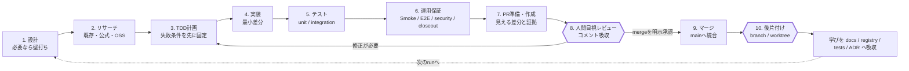

# engineering-brain

engineering-brain は、開発判断・実装・検証・運用保証を「読んで終わり」にせず、作業前後に通せる形へ落とす local-first engineering autopilot です。

Fractal Decision Ecosystem（FDE）が AI ルーティングと意思決定の OS だとすると、engineering-brain は開発実装の保証 OS です。ここでの「100%」はバグゼロ断定ではありません。保証できること、未確認、残リスク、人間承認が必要な境界を、毎回 100% 分離して返すという意味です。

## What This Does

| question | answer |
|---|---|
| Why | 開発のたびに判断、調査、実装、検証、PR、公開判断が散らばる問題を解く。嬉しいことは、毎回同じ入口で「作るべきか」「既存で足りるか」「何をテストしたか」「何は人間承認か」まで確認できること。 |
| How | task を `route / gate / catalog / skill-sync / closeout` の run packet にまとめ、TDD、既存調査、公開前 redaction、GitHub visibility などの停止線を分ける。 |
| What | `devbrain` CLI、`engineering-autopilot` runtime skill、docs / registry / tests / ADR を使う local-first な開発保証 repo。 |

具体的には、作る前に既存実装・公式機能・OSS 候補を確認し、local trial や Obsidian / memory / web / GitHub 由来の学びを docs / registry / tests / ADR へ吸収します。

## 開発ライフサイクル

engineering-brain が目指すのは、コードを書く部分だけの自動化ではありません。相談から後片付けまでを 1 本の run として扱い、各段階で「次へ進める証拠」と「人間が判断する停止線」を残します。



`四角` はローカルで証拠を揃えながら進める工程、`二重枠` は current conversation の人間承認が必要な工程です。公開、外部送信、credential、production、visibility 変更も同じく自動では越えません。

| 工程 | まず確認すること | 成果物・証拠 | 次へ進めない条件 |
|---|---|---|---|
| 1. 設計・壁打ち | Why、非目標、SSOT、owner、write scope、ADR要否 | task / design packet | repo・責任者・境界が不明 |
| 2. リサーチ | repo-local → workspace共有 → 公式 → OSS → local fit | research packet、`reuse / wrap / extend / adopt_oss / build / hold` | 最新性・license・securityが不明 |
| 3. TDD計画 | 期待する失敗、対象Smoke、回帰範囲 | failing test、verification plan | 成功条件をテストできない |
| 4. 実装 | 既存helper、shared script、最小差分 | implementation diff | secret・credential・production変更が未承認 |
| 5. テスト | unit、integration、compile、negative path | test log | 必須testが未実行または失敗 |
| 6. 運用保証 | riskに応じた preflight、Smoke、E2E、security、closeout | verification matrix、既知の残リスク | 未確認を「保証済み」と呼ぶ状態 |
| 7. PR準備・作成 | visible scope、checks、unknown、personal path、secret | 日本語PR packet、Draft PR | 外から見える内容が不明、作成承認なし |
| 8. 人間目視レビュー | diff、動作、文言、review comment | 承認または修正指示 | unresolved comment、目視未完了 |
| 9. マージ | latest head、checks、review、merge可否 | merge commit | current conversation のmerge承認なし |
| 10. 後片付け | merged proof、dirty state、他者worktree | main同期、cleanup plan | 未merge・dirty・削除承認なし |

現在のCLIはこのうち run packet、research packet、gate、closeout、skill drift check、version、merge後cleanup planを実装済みです。PR packet generatorやverification profileの拡張はロードマップ上の次段階です。

## Quick Start

```powershell
python -m devbrain run --task "implement small python CLI feature and prepare PR" --domain python --json
python -m devbrain research --task "choose a Python test approach" --domain python --decision hold --rationale "needs upstream evidence" --json
python -m devbrain closeout --repo . --json
```

## Core Commands

| command | 目的 |
|---|---|
| `python -m devbrain run --task "<task>" --json` | route / gate / catalog / skill-sync / closeout stopline を 1 packet にまとめる |
| `python -m devbrain research --task "<question>" --domain python --decision hold --json` | 候補sourceと採否・保留理由を research packet にする |
| `python -m devbrain route --task "<task>" --json` | task から必要 gate を推定する |
| `python -m devbrain gate --trigger implementation --json` | trigger から採用済み / candidate gate を確認する |
| `python -m devbrain catalog --domain python --json` | 技術別の一次情報 / best-practice candidate を見る |
| `python -m devbrain skill-sync --json` | repo-owned skill source と runtime projection の drift を見る |
| `python -m devbrain version --json` | version surface と release policy を見る |
| `python -m devbrain finish --json` | merge 後の local / remote branch cleanup 候補を plan する |
| `python -m devbrain hooks install --json` | repo 同梱の opt-in Git hook をローカル `.git/hooks/` へ入れる |
| `python -m devbrain closeout --repo . --json` | test / compile / path redaction / external boundary を検証する |

## Current Status

| item | status |
|---|---|
| version | `0.1.0` public seed |
| visibility | public |
| license | MIT |
| runtime skill | `engineering-autopilot` synced projection |
| release / GitHub tag | not created; separate approval |
| primary next work | PR packet generator / verification profile |

## Local SSOT

現行 engineering-brain の local SSOT は `<PROJECTS_ROOT>/Documents/repos/engineering/engineering-brain` です。`nexus-ai-2045/engineering-brain` は GitHub review surface です。詳しくは [Local SSOT](docs/LOCAL_SSOT.md) を参照します。

`dev-brain` からの private recreate については [Migration notes](docs/MIGRATION_NOTES.md)、[engineering-brain cutover plan](docs/ENGINEERING_CUTOVER_PLAN.md)、[private cutover packet](docs/PRIVATE_CUTOVER_PACKET.md) を参照します。

## Guardrails

| gate | 目的 |
|---|---|
| fact/source | 事実・推測・不明を分ける |
| scope/write-boundary | 作業範囲、owner、write scope、Type1 risk を固定する |
| TDD/regression | bug fix と実装を test/smoke なしに完了扱いしない |
| security/containment | agent、browser、connector、credential、hook/settings の境界を確認する |
| publication/GitHub visibility | 公開、外部送信、repo public 化、push/PR を人間確認まで止める |
| public path redaction | 実ユーザー名を含むローカル絶対パスを公開候補 artifact に残さない |

## Engineering Autopilot

`engineering-brain / engineering-autopilot` の発展形は [Autopilot goal design](docs/AUTOPILOT_GOAL_DESIGN.md) にまとめています。設計、リサーチ、TDD、実装、検証、PR、人間レビュー、merge、branch/worktree cleanup までを 1 つの run packet として扱うための状態機械です。

`devbrain run` は、route / gate / catalog / skill-sync / closeout stopline を 1 つの run packet にまとめる MVP です。既定では計画 packet を返し、local verification は `--closeout` 指定時だけ実行します。

`devbrain finish` は、merge 後に残った local / remote branch cleanup 候補を返します。既定は plan-only です。local branch 削除は `--apply-local`、remote branch 削除は別途 current conversation approval が必要です。

repo 同梱 hook は `tools/hooks/post-merge` にあります。`python -m devbrain hooks install --json` で opt-in install すると、merge 後に `devbrain finish --json` の plan だけを表示します。hook は branch を自動削除しません。

Repo-owned skill source は `skills/engineering-autopilot/` にあります。runtime install copy は `<USER_HOME>/.codex/skills/engineering-autopilot` へ同期済みです。差分は `python -m devbrain skill-sync --json` で確認します。

Contribution / PR の境界は [Contributing](CONTRIBUTING.md) と `.github/` templates を参照します。

直近の実装順序は [Next goal design](docs/NEXT_GOAL_DESIGN.md) を参照します。

## ADR / knowledge intake

設計判断は [ADR](docs/adr/README.md) に残します。Obsidian や local memory は正本ではなく入口として扱い、採用済みの知見だけを [Knowledge intake](docs/KNOWLEDGE_INTAKE.md) の流れで docs / registry / tests / ADR / skill source へ昇格します。

version 管理は [Versioning](docs/VERSIONING.md) を参照します。public seed は `0.1.0` で、tag / GitHub Release は別承認です。

Vision、GitHub、X、Web 上の他者の詰まりや解決策は [Community learning intake](docs/COMMUNITY_LEARNING_INTAKE.md) の source packet として扱います。

ブラウズ中に良いと思ったものや Obsidian に落とした note を採用する時は、[Field review loop](docs/FIELD_REVIEW_LOOP.md) で local experiment と human field review を通します。

実行結果とレビューを次の gate / docs / registry / tests へ戻す仕組みは [PDCA feedback loop](docs/PDCA_FEEDBACK_LOOP.md) を参照します。

必須概念がどこまで入っているかは [Concept coverage](docs/CONCEPT_COVERAGE.md) を参照します。

## 技術別ベスプラ catalog

`registry/technology-sources.yaml` に Go、Bun、Vue/Nuxt、Azure、サーバー/API、コンテナ/Kubernetes、GitHub repo lifecycle の公式・一次情報 source を `candidate` として登録しています。

これは「採用済み保証」ではなく、実プロジェクトへ入る前の source catalog です。`devbrain catalog --domain <domain> --json` で対象 domain の source と gate hint を確認します。

## 完了判定

`closeout` は次を分けて返します。

- `implementation`: 実装差分や構成があるか
- `verification`: test / compile / smoke が揃うか
- `operation`: 継続運用に必要な gate が揃うか
- `external_public`: 公開・外部送信・GitHub visibility などの人間承認境界
- `public_path_redaction`: `<PROJECTS_ROOT>` / `<USER_HOME>` / `<REPO>` へ置換されているか

## 公開境界

この repo は local-first です。visibility 変更、release、外部告知、広範な共有はそれぞれ別の承認境界として扱います。public 化を行う場合は、対象 repo、exact operation、見える内容、secret scan、README、LICENSE、SECURITY.md、公開可否を提示して current conversation の明示承認を取ります。
