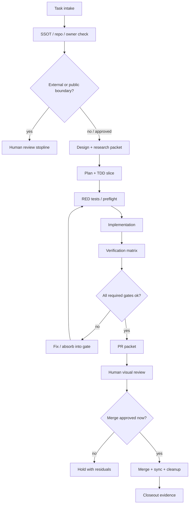

# Engineering autopilot goal design

status: draft
owner: nexus_ai
checked_at: 2026-07-14 JST

## 目的

`engineering-brain / engineering-autopilot` は、開発作業を「よく考える」だけで終わらせず、設計、調査、TDD、実装、検証、運用保証、PR、人間レビュー、merge、後片付けまで同じ判断面で通すための local-first 開発保証システムにする。

ここでの自走は、公開、外部送信、GitHub visibility 変更、merge、hook/settings/auth 変更を無人で実行する意味ではない。自走とは、各段階で次に必要な gate、成果物、停止線、証拠を機械的に選び、人間承認が必要な境界では止まれることを指す。

## ゴール状態

`engineering-autopilot` を叩くと、次の 10 段階を 1 つの run として扱える。

1. intake: task、repo、owner、公開境界、既存 SSOT を固定する。
2. design: 変更理由、非目標、設計判断、ADR 要否を決める。
3. research: 公式 docs、既存実装、OSS、先行事例、security guidance を採否付きで読む。
4. plan: TDD slice、write scope、検証範囲、rollback/cleanup を分解する。
5. red: 期待する失敗テスト、preflight、smoke を先に作る。
6. green: 実装する。既存 helper / shared scripts / registry を優先する。
7. refactor: 差分を小さくし、重複、命名、境界、公開候補 path を整える。
8. verify: unit / integration / smoke / E2E / security / closeout を実行し、結果を保存する。
9. review: PR を作り、人間目視レビュー、コメント吸収、再検証を回す。
10. finish: merge 承認後に merge、main 同期、branch/worktree cleanup、運用証跡更新を行う。

## 全体図



## 状態機械

| state | 入力 | 必須 output | 進行条件 | 停止線 |
|---|---|---|---|---|
| `intake` | user task / repo path / thread context | task packet | SSOT と write scope が確認済み | repo 不明、owner 不明、dirty/stale 衝突 |
| `design` | task packet | design note / ADR decision | 非目標と採用理由が書ける | 既存設計と矛盾 |
| `research` | domain / stack | source packet | 公式 docs / primary source / repo-local source がある | 推測だけ、最新性が必要で未確認 |
| `plan` | design + source | TDD plan | test、implementation、verification が分かれる | scope が広すぎる |
| `red` | TDD plan | failing test / smoke expectation | 失敗理由が目的と一致 | テスト不能な要求 |
| `green` | failing test | implementation diff | targeted tests が通る | secret / credential / auth / production 変更 |
| `verify` | diff | verification matrix | closeout が ok または blocked reason が明確 | 未実行を done と呼ぶ誘惑 |
| `review` | verified diff | PR packet | PR 本文に境界と証拠がある | 外から見える内容が不明 |
| `merge` | review approval | merge commit / main sync | current conversation で merge OK | approval なし |
| `cleanup` | merged branch | clean main / deleted branch | local/remote branch 整理済み | worktree に他者差分あり |

## Run packet

自走 run は次の JSON 相当を持つ。

```json
{
  "task": "",
  "repo": "<REPO>",
  "ssot": "",
  "owner": "",
  "mode": "design|implement|review|finish",
  "risk": {
    "public": false,
    "external_send": false,
    "credential": false,
    "production": false,
    "hook_or_settings": false
  },
  "sources": [],
  "selected_gates": [],
  "write_scope": [],
  "tests": [],
  "human_stoplines": [],
  "cleanup": []
}
```

## Gate contract

既存 `adoption-units.yaml` を拡張し、各 gate は最低限これを持つ。

| field | 意味 |
|---|---|
| `id` | 安定した gate 名 |
| `applies_when` | trigger / task phrase |
| `timing` | before_work / before_patch / before_done / before_external_action |
| `boundary` | 何を防ぐか |
| `checks` | 実行可能 command または human acceptance |
| `insufficient_if` | NG 条件 |
| `evidence_schema` | closeout に載せる形 |
| `owner` | local / human / external reviewer |

## Reinvention avoidance gate

`engineering-autopilot` は、実装前に「作るべきか」を必ず確認する。車輪の再発明を避ける観点は research phase の必須 gate として扱う。

確認順:

1. repo-local: 既存 CLI、module、helper、test、registry、docs、ADR、runbook を探す。
2. workspace-local: `<PROJECTS_ROOT>/shared/scripts`、`shared/lib`、既存 skill、FDE / Documents の正本を探す。
3. official capability: 言語、framework、cloud、OpenAI / GitHub / Azure 等の公式機能を確認する。
4. established OSS: maintenance、license、security posture、API stability、Windows 対応、既存 stack との相性を見る。
5. adopt / wrap / extend / build decision: 丸写しではなく、不足要素だけを実装する。

判断:

| decision | 使う条件 | 禁止事項 |
|---|---|---|
| `reuse` | 既存機能で足りる | 新規実装を足さない |
| `wrap` | 既存機能は足りるが入口が分かりにくい | wrapper に policy を重複実装しない |
| `extend` | 既存機能に小さな gap がある | upstream / local helper を迂回しない |
| `adopt_oss` | OSS が保守され、license と運用境界が合う | OSS の責任範囲を未確認のまま採用しない |
| `build` | 既存・公式・OSS が要件、境界、保証に合わない | 「知らないから作る」を許可しない |
| `hold` | 調査不足、最新性不足、security 不明 | 推測で採用しない |

run packet には `reinvention_check` を持たせる。

```json
{
  "reinvention_check": {
    "repo_local_checked": true,
    "workspace_shared_checked": true,
    "official_capability_checked": true,
    "oss_candidates": [],
    "decision": "reuse|wrap|extend|adopt_oss|build|hold",
    "reason": "",
    "insufficient_if": []
  }
}
```

`build` を選ぶ時は、なぜ既存・公式・OSS では足りないか、どの範囲だけ自作するか、後で置き換え可能にする境界を明記する。

## Research and GitHub method

research phase は、思いつき検索ではなく、短い調査 packet として残す。

調査順:

1. repo-local truth: README、docs、ADR、existing modules、tests、open issues、open PR、recent commits。
2. official docs: 対象言語、framework、SDK、cloud、CLI の公式 docs / changelog / migration guide。
3. GitHub evidence: upstream repo、release cadence、issues、PR、security policy、license、stars ではなく maintenance signal。
4. ecosystem practice: well-known OSS、reference implementation、standard checklist、security guidance。
5. local fit: Windows、既存依存、CI、offline/local-first、secret/public boundary、runtime skill との相性。

GitHub で見る項目:

| item | 見る理由 | insufficient_if |
|---|---|---|
| `README` / docs | 機能範囲と導入前提 | quickstart だけで production 境界を見ていない |
| releases / tags | メンテ状況と breaking changes | 最終更新が古いのに代替確認なし |
| issues / discussions | 既知バグ、Windows 問題、運用上の詰まり | open issue を無視して採用 |
| PR activity | 実装品質、review 文化、停滞 | unmerged critical fix が放置 |
| `SECURITY.md` / advisories | 脆弱性報告経路 | security policy 不明のまま sensitive path に採用 |
| license | 再利用・公開時の制約 | license 不明 / incompatible |
| tests / CI | 信頼性 | test なしで critical dependency にする |

research packet には次を入れる。

```json
{
  "research": {
    "question": "",
    "sources_checked": [],
    "github_repos_checked": [],
    "official_docs_checked": [],
    "candidate_options": [],
    "decision": "reuse|wrap|extend|adopt_oss|build|hold",
    "reason": "",
    "known_risks": [],
    "stop_reason": ""
  }
}
```

打ち切り条件:

- repo-local / official / GitHub の 3 系統を見た。
- 既存で足りる、または不足箇所が特定できた。
- sensitive / public / credential / production risk があれば `hold` にできた。
- 「もっと調べれば何かあるかも」ではなく、次の実装判断に必要な証拠が揃った。

## Architecture components

自走化は 1 つの巨大関数にしない。次の component に分ける。

| component | 役割 | MVP |
|---|---|---|
| Intake / Policy Router | task、repo、owner、risk、SSOT、trigger を run packet に固定する | 既存 `route` と `gate` を統合 |
| Lifecycle Engine | phase、遷移、禁止遷移、失敗、再試行、cancel を fail-closed に扱う | `registry/lifecycle-phases.yaml` + `devbrain/lifecycle.py` |
| Durable State Store | `run_id`、state、evidence、approval、target commit を保持する | `.devbrain/state.sqlite3` または JSON exportable packet |
| Local Executor | allowlist 済みの read-only / local command だけ実行する | argv 配列、cwd 固定、timeout、出力上限 |
| Evidence Store | 実行予定と実行済みを分離し、command / exit code / timestamp / stdout summary を保存する | run packet 内 `evidence[]` |
| Approval Broker | approval を repo、commit、action、visible scope、expiry に束縛する | 古い OK の再利用を拒否 |
| Git Adapter | local branch、commit、diff、worktree、main sync を扱う | push しない local readiness |
| GitHub Adapter | push、PR、review、merge、remote branch cleanup を扱う | 既定は command plan のみ |
| Learning Intake | review comment と失敗を policy / gate / test に吸収する | `fix-required / optional / rejected / unknown` 分類 |

MVP は Python FSM + SQLite/JSON で十分。Temporal などの workflow engine は、複数 repo / 長時間 worker / distributed lease が必要になるまで採用しない。

## Plugin / agent orchestration

| 能力 | 使いどころ | 自走ルール |
|---|---|---|
| architect | architecture / ADR / scalability / boundary | 大きな設計変更の sidecar。最終判断は main agent |
| planner | TDD slice / dependency / phase split | 実装前の work breakdown |
| visualize | goal map / flow / review aid | Mermaid / report / dashboard を作る。公開は別承認 |
| openai-developers | OpenAI API / SDK / platform 仕様 | 公式 docs と local setup を確認してから採用 |
| template-creator | repeatable packet / PR body / runbook template | run packet と review packet の雛形化 |
| security-guidance / codex-security | threat model / containment / secret / supply chain | credential、agent、browser、connector、hook、settings で必須 |
| creative-production / product-design | public-facing artifact / UX / docs polish | 公開候補は human review stopline へ送る |
| github | PR / review / merge / cleanup | private PR でも owner / visible scope / approval を確認 |

## Verification matrix

| layer | command / evidence | 必須化タイミング |
|---|---|---|
| unit | `python -m pytest -q` | code diff |
| compile | `python -m compileall -q devbrain tests` | Python code diff |
| route | `python -m devbrain route --task "<task>" --json` | gate / router diff |
| gate | `python -m devbrain gate --trigger <trigger> --json` | registry diff |
| closeout | `python -m devbrain closeout --repo . --json` | before PR / before final |
| path redaction | closeout `public_path_redaction.status=ok` | public candidate / PR text |
| PR readiness | owner / branch / visibility / body / diff scope | before push / PR |
| merge readiness | PR state / checks / human approval | before merge |

## Human stoplines

次は常に現在会話の明示承認まで止める。

- GitHub repository visibility を public にする。
- 外部送信、投稿、公開、release、launch、広範な共有。
- merge。
- hook / settings / auth / credential / billing / production state を変える。
- destructive delete / production DB `DROP` / `TRUNCATE`。
- private corpus を外部 AI に送る。

## MVP roadmap

### Slice 1: run packet and lifecycle command

- `devbrain run --task ... --repo ... --json` を追加する。
- `route`、`gate`、`closeout` の結果を 1 packet に統合する。
- TDD: packet に `selected_gates`、`human_stoplines`、`verification_plan` が入ること。

実装候補:

- `schemas/run-packet.schema.json`
- `registry/lifecycle-phases.yaml`
- `devbrain/lifecycle.py`
- `tests/test_lifecycle.py`
- `tests/test_run_packet.py`

### Slice 2: research packet

- `technology-sources.yaml` から domain source を選び、`source_status=candidate|adopted|hold` を返す。
- 最新性が必要な source は live confirmation required として止める。
- TDD: Go / Azure / server-api / unknown domain。

実装候補:

- `devbrain/planner.py`
- `tests/test_planner.py`
- `tests/test_registry.py` の freshness case

### Slice 3: verification profile

- repo 内容を見て Python / Node / Go / Docker / Terraform などの smoke 候補を返す。
- まずは read-only detection。外部状態を変える command は生成しても実行しない。

実装候補:

- `registry/verification-profiles.yaml`
- `devbrain/executor.py`
- `tests/test_verification_profiles.py`
- `tests/test_executor.py`

### Slice 4: PR packet

- PR title/body の日本語 template を生成する。
- visible scope、checks、未確認、human stoplines、public path redaction を含める。

実装候補:

- `devbrain/review.py`
- `tests/test_review_packet.py`

### Slice 5: finish command

- merge 承認後だけ `ready -> merge -> fetch -> main sync -> branch cleanup` の手順を出す。
- 最初は command plan のみ。実行は別の current-turn approval に従う。

実装候補:

- `devbrain/identity.py`
- `devbrain/finish.py`
- `tests/test_identity.py`
- `tests/test_finish.py`

### Slice 6: repo-owned skill

- 当面は `skills/engineering-autopilot` を repo 内に置く。
- skill は CLI を呼ぶ薄い入口にし、判断ロジックを runtime skill 側へ複製しない。
- `.codex/skills` など runtime install copy への同期は別承認にする。

### Slice 7: engineering cutover packet

- directory、GitHub repo、runtime skill、registry の 4 層移行案を作る。
- `dev-brain` 互換入口と rollback を残す。
- public 化はこの slice に含めない。visibility 変更は別 review packet と明示 yes が必要。
- rename と private recreate の判断は [engineering-brain cutover plan](ENGINEERING_CUTOVER_PLAN.md) に従う。

## Implementation order

| order | slice | 成果物 | Done |
|---:|---|---|---|
| 0 | current design | この設計 doc と README pointer | closeout ok |
| 0.5 | migration ledger | [PR #1 migration ledger](PR1_MIGRATION_LEDGER.md) | adopt / rewrite / reject が file 単位で決まる |
| 1 | lifecycle contract | schema / phase registry / lifecycle tests | 不正遷移が fail-closed |
| 2 | planner | task から TDD / research / verification plan | unknown / public / credential fixture が通る |
| 3 | executor | allowlist command + evidence | arbitrary shell が拒否される |
| 4 | closeout v2 | run evidence based closeout | 未実行 / 失敗 / not-applicable を分離 |
| 5 | PR packet | 日本語 PR body generator | GitHub 操作なしで packet 生成 |
| 6 | finish planner | merge / sync / cleanup plan | dirty / unmerged / stale が止まる |
| 7 | skill | repo-owned thin skill | runtime copy なしで CLI 完結 |
| 8 | cutover | engineering-* migration packet | 実 rename / public 化は別承認 |

## Anti-goals

- 古い branch や stale clone を丸ごと cherry-pick しない。
- planner だけを作って「自走」と呼ばない。
- 任意 shell 実行を許さない。
- PR 作成、merge、cleanup、visibility 変更を同じ承認に束ねない。
- skill 側に repo の判断ロジックを複製しない。
- public path redaction を迂回しない。

## Public cutover candidate

現時点の live SSOT は `engineering-brain` である。public 化は次を満たしてから別 review packet で扱う。

- repo directory、GitHub repo、runtime skill、registry の 4 層で同じ名前へ移行する。
- `PUBLIC_READY.md`、LICENSE、SECURITY.md、README、secret scan、personal path scan、commit history review が通る。
- public visibility 変更は repo ごとに exact command と見える内容を提示し、明示 yes を得る。

## Done definition

`engineering-autopilot` が self-driving と呼べるのは、最低限次を満たした時。

- run packet が作れる。
- task から gate / research / TDD / verification / human stopline を選べる。
- closeout が実行証拠を返す。
- PR packet が作れる。
- merge/cleanup は承認された時だけ実行される。
- review comment を policy / gate / test に吸収できる。
